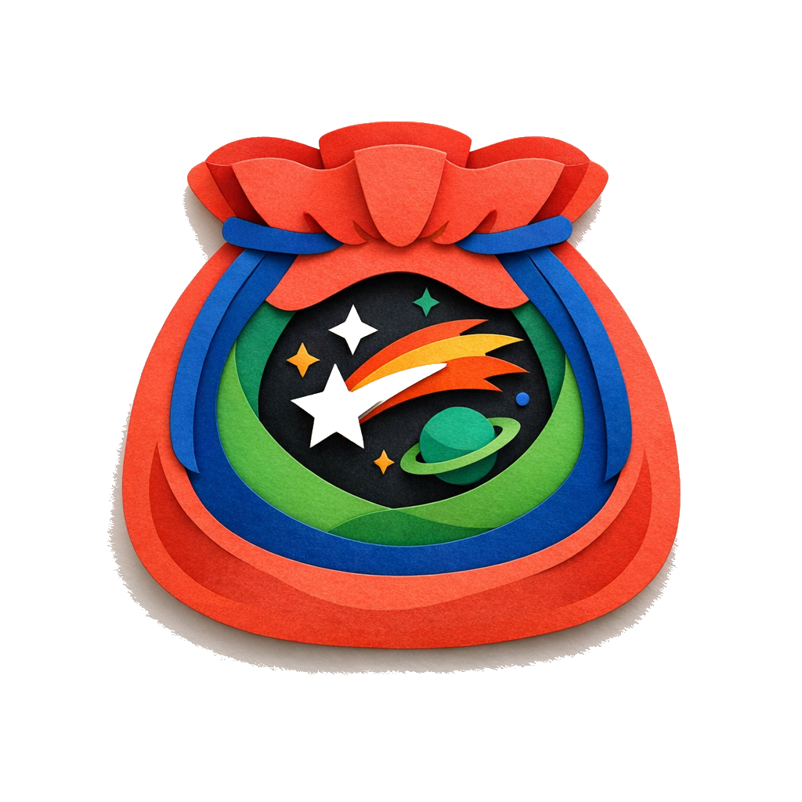

<div align="center">



# Nova Pouch

**차원의 주머니에서 발견한 파편으로 세계를 기록하세요**

*Trivial objects that crossed the veil — beyond them lie vast worlds.*

[](https://github.com/jiunbae/nova-pouch/actions/workflows/deploy.yml)

[**Play Now**](https://nova-pouch.jiun.dev) · [Report Bug](https://github.com/jiunbae/nova-pouch/issues)

</div>

---

## How It Works

Three pouches, three fragments, one world.

```
🔴 Object     →  물건의 파편     a key, a compass, a mask…
🔵 Property   →  속성의 파편     whispering, magnetic, weightless…
🟢 Constraint →  제약의 파편     only at dawn, costs a memory, breaks after use…
```

Draw one fragment from each pouch. Together they form a combination — the seed of an imaginary world where this strange combo is simply *everyday life*. Write the world into existence.

## Features

- **Daily Puzzle** — Same fragments for everyone, new combination each day (Day #1 = 2025-08-27)
- **Free Play** — Unlimited random draws for when inspiration strikes
- **Share Cards** — Canvas-generated image cards with your world record
- **Community Feed** — Read how others imagined the same combination
- **Bilingual** — Full Korean and English support
- **Offline-first** — All records saved locally, API is optional

## Tech Stack

| | |
|---|---|
| **Runtime** | Vanilla TypeScript — zero framework, zero runtime deps |
| **Build** | Vite 6 |
| **State** | Custom pub/sub state machine (`state.ts`) |
| **Rendering** | DOM API only — no virtual DOM, no innerHTML (XSS-safe) |
| **i18n** | `data-i18n` attribute system with `\n → <br>` via DOM nodes |
| **Share** | Canvas 2D API for image generation |
| **Deploy** | GitHub Pages via Actions |

## Getting Started

```bash
git clone https://github.com/jiunbae/nova-pouch.git
cd nova-pouch
npm install
npm run dev        # http://localhost:5173
```

```bash
npm run build      # tsc --noEmit && vite build → dist/
npm run typecheck   # type-check only
npm test           # build + Playwright E2E
```

## Theme Item Assets

`item-key`, `item-compass` 아이템은 테마별 PNG를 생성해서 사용합니다.

```bash
npm run generate:theme-assets
```

- Azure GPT Image 키 기본 경로: `~/keys/openai.azure.com/gpt-image-1.5.json`
- 출력 경로: `assets/images/themes/`

## Project Structure

```
src/
├── app.ts          # Bootstrap, event binding, overlay management
├── state.ts        # Pub/sub state machine (IDLE → DRAWING → REVIEW → WRITING → COMPLETE)
├── renderer.ts     # DOM rendering, step transitions, history cards
├── pouch.ts        # Draw animation sequence (shake → rise → flip → reveal)
├── tokens.ts       # 50-token registry, weighted random, difficulty calc
├── daily.ts        # Deterministic daily hash, completion tracking
├── share.ts        # Canvas share card generation, Twitter/native share
├── feed.ts         # Community feed (lazy-loaded)
├── i18n.ts         # ko/en string table, data-i18n DOM walker
├── api.ts          # API client with AbortController timeouts
├── history.ts      # localStorage session persistence
├── countdown.ts    # Next-puzzle countdown timer
└── types.ts        # Shared type definitions
```

## Inspiration

> 막을 건너온 사소한 물건들, 그 너머에 존재하는 것은 거대한 세계와 사람들.
> 할 수 있는 것은 오직 상상하는 일뿐.
>
> — 김초엽, 《양면의 조개껍데기》 중 〈비구름을 따라서〉

---

<div align="center">
<sub>Built with curiosity and imagination</sub>
</div>
